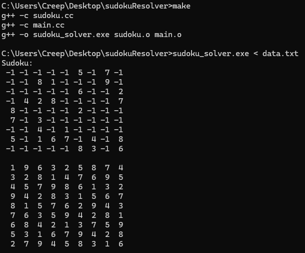

# Sudoku Solver

Este repositorio contiene una implementación en C++ de un solucionador de Sudoku que utiliza una combinación de técnicas de resolución lógica y backtracking para encontrar la solución.

## Clase Sudoku

La clase `Sudoku` representa un tablero de Sudoku 9x9 y proporciona métodos para su resolución.

### Características principales:
- Implementa dos estrategias de resolución: lógica directa y backtracking inteligente
- Verifica la validez del tablero
- Permite cargar tableros manualmente o mediante entrada estándar
- Proporciona métodos para acceder y modificar el tablero

### Métodos públicos principales:

| Método | Descripción |
|--------|-------------|
| `resolver()` | Resuelve el Sudoku completo |
| `resolverPos(i, j)` | Intenta resolver una celda específica |
| `DevolverLosFaltantesPos(i, j)` | Devuelve valores posibles para una celda |
| `estaResulto()` | Verifica si el Sudoku está resuelto |
| `setPos(i, j, val)` | Asigna un valor a una celda |
| `getPos(i, j)` | Obtiene el valor de una celda |
| `imprimirTablero()` | Muestra el tablero actual |

### Métodos privados:
- `resolverConProp()`: Backtracking con mapa de posibles valores
- `resolverParcial()`: Resolución lógica directa
- `resolverParcialProb()`: Prepara datos para backtracking
- `obtener3x3()`: Obtiene valores en subcuadrícula 3x3
- `obtenerLineas()`: Obtiene valores en fila y columna

## Uso básico

```cpp
#include "sudoku.hh"

int main() {
    Sudoku sudoku;
    
    // Cargar tablero (ejemplo con entrada estándar)
    sudoku.leerTablero();
    
    // Resolver el Sudoku
    sudoku.resolver();
    
    // Mostrar resultado
    sudoku.imprimirTablero();
    
    return 0;
}
```

## 🚀 Ejecución del Programa

### Método 1: Entrada interactiva (manual)
```bash
sudoku_solver.exe
```

Ingresa el tablero línea por línea (9 filas de 9 números separados por espacios), donde -1 representa celdas vacías:

|  4  |  -1 |  -1 |  -1 |  9  |  -1 |  -1 |  -1 |  -1 |
| --- | --- | --- | --- | --- | --- | --- | --- | --- |
| -1  |  -1 |  -1 |  -1 |  3  |  -1 |  4  |  7  |  -1 |
| -1  |  -1 |  -1 |  -1 |  -1 |  -1 |  -1 |  3  |  1  |
|  1  |  -1 |  -1 |  3  |  -1 |  -1 |  5  |  -1 |  7  |
|  3  |  5  |  -1 |  -1 |  7  |  6  |  -1 |  -1 |  -1 |
|  2  |  4  |  -1 |  9  |  -1 |  -1 |  -1 |  -1 |  -1 |
|  6  |  -1 |  -1 |  -1 |  -1 |  7  |  2  |  9  |  8  |
| -1  |  7  |  -1 |  2  |  -1 |  -1 |  -1 |  -1 |  5  |
|  9  |  2  |  4  |  5  |  8  |  -1 |  -1 |  -1 |  -1 |

### Método 2: Entrada desde archivo
```bash
sudoku_solver.exe < data.txt
```
Como el data.txt de ejemplo

### Salida esperada

El programa mostrará la solución completa con el siguiente formato:
|  4  |  8  |  7  |  6  |  9  |  1  |  3  |  5  |  2  |
| --- | --- | --- | --- | --- | --- | --- | --- | --- |
|  6  |  1  |  2  |  8  |  3  |  5  |  4  |  7  |  9  |
|  5  |  9  |  3  |  7  |  4  |  2  |  8  |  3  |  1  |
|  1  |  6  |  8  |  3  |  2  |  4  |  5  |  9  |  7  |
|  3  |  5  |  9  |  1  |  7  |  6  |  9  |  8  |  4  |
|  2  |  4  |  7  |  9  |  5  |  8  |  1  |  6  |  3  |
|  6  |  3  |  5  |  4  |  1  |  7  |  2  |  9  |  8  |
|  8  |  7  |  1  |  2  |  6  |  9  |  7  |  4  |  5  |
|  9  |  2  |  4  |  5  |  8  |  3  |  6  |  1  |  7  |

**Características de la salida:**
- Todos los `-1` son reemplazados por valores válidos (1-9)
- Se mantiene el formato de cuadrícula 9x9 con separadores visuales
- Los bloques 3x3 están delimitados con líneas
- Espaciado consistente entre números

**SO:**
- Si se utiliza otra sistema el método de ejecucion sera diferente

**Validación automática:**
1. El programa verifica que la solución sea correcta
2. Comprueba que no haya repeticiones en filas, columnas o bloques
3. Confirma que todos los valores estén entre 1 y 9

## 📋 Requisitos
- Compilador C++ compatible con C++11 o superior

## 🔧 Compilación
```bash
g++ -std=c++11 main.cpp sudoku.cpp -o sudoku_solver
```

**Con un make ya configurado:**
Compila le programa
```bash
make
```

Borra todos los archivos .o y el ejecutable
```bash
make clean
```

## 🧠 Estrategia de Resolución

El solucionador implementa un enfoque híbrido inteligente:

1. **Fase de Lógica Directa**:
   - Resuelve primero las celdas con solución única evidente
   - Analiza filas, columnas y bloques 3x3 para encontrar valores obligatorios
   - Itera hasta que no pueda encontrar más soluciones directas

2. **Fase de Backtracking Inteligente**:
   - Selecciona siempre la celda con menos posibilidades
   - Utiliza propagación
   - Implementa retroceso (backtracking) cuando detecta contradicciones
   - Mantiene un mapa de posibles valores por celda para optimizar el proceso

## 📝 Notas Importantes

- **Representación**:
  - Celdas vacías se marcan con `-1`
  - El tablero completo es una matriz 9x9 de valores enteros

- **Validación**:
  - Verifica la solución completa antes de aceptarla
  - Comprueba que no haya repeticiones en filas, columnas o bloques 3x3

- **Optimizaciones**:
  - Evita búsquedas redundantes mediante memoización
  - Ordena las celdas por dificultad para resolver primero las más restrictivas

## Archivos importantes
- Las cabezeras estan en sudoku.hh el cual depende de sudoku.cc

## Ejemplo gràfico
Dado el ejemplo ubicado en data.txt
| -1  | -1  | -1  | -1  | -1  |  5  | -1  |  7  | -1  |
| --- | --- | --- | --- | --- | --- | --- | --- | --- |
| -1  | -1  |  8  |  1  | -1  | -1  | -1  |  9  | -1  |
| -1  | -1  | -1  | -1  | -1  |  6  | -1  | -1  |  2  |
| -1  |  4  |  2  |  8  | -1  | -1  | -1  | -1  |  7  |
|  8  | -1  | -1  | -1  | -1  |  2  | -1  | -1  | -1  |
|  7  | -1  |  3  | -1  | -1  | -1  | -1  | -1  | -1  |
| -1  | -1  |  4  | -1  |  1  | -1  | -1  | -1  | -1  |
|  5  | -1  |  1  |  6  |  7  | -1  |  4  | -1  |  8  |
| -1  | -1  | -1  | -1  | -1  |  8  |  3  | -1  |  6  |


